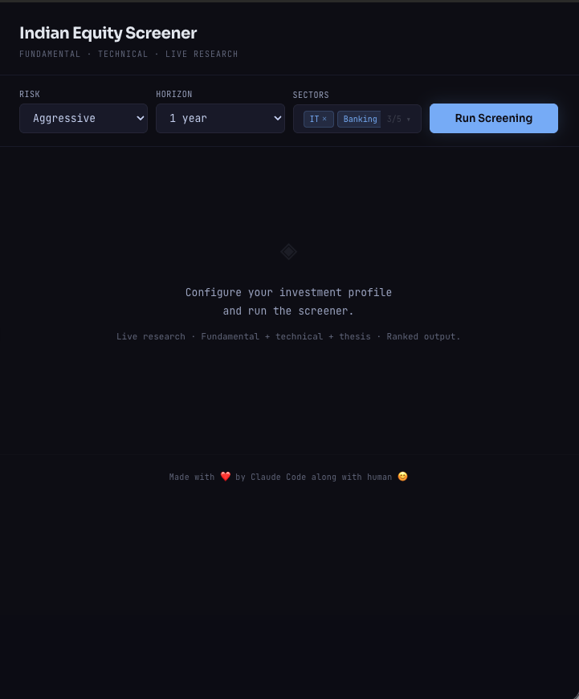

# Indian Stock Screener POC

A browser-native AI stock screening tool for NSE-listed Indian equities. No server. No backend. No build step. One HTML file, one API key, runs entirely in the browser.

Built as a proof of concept at the intersection of AI-native UX and production-grade financial research tooling.



---

## Repository Structure

```
indian-stock-screener/
├── IndianStockScreener.html          # Standalone deployable — open in browser directly
├── claude_artifacts/
│   ├── IndianStockScreener.jsx       # React source — paste into Claude as an artifact
├── screenshots/                      # UI screenshots
├── sample_output/
│   ├── indian-eq-screener_*.json     # Sample exported JSON report
│   └── *.png    
|   demo.gif                          # Sample demo video
|   LICENSE                           # Project License
└── README.md                         # Project description 
```

**Two delivery formats, same application logic:**

```
IndianStockScreener.jsx
  |
  |-- Claude artifact environment  -->  paste into claude.ai, runs immediately
  |                                     auth handled by Claude's own API context
  |
  +-- IndianStockScreener.html     -->  open locally in any browser
                                        enter your Anthropic API key when prompted
                                        no server, no node_modules, no installations
```

---

## Quick Start

### Option A — Claude Artifact (no API key needed)

1. Open [claude.ai](https://claude.ai)
2. Paste the contents of [`claude_artifacts/IndianStockScreener.jsx`](claude_artifacts/IndianStockScreener.jsx) into a message
3. Claude renders it as an interactive artifact
4. Select sectors, set your profile, run

### Option B — Local HTML

1. Download [`IndianStockScreener.html`](IndianStockScreener.html)
2. Open it in Chrome or Firefox (double-click or drag into browser)
3. Enter your Anthropic API key when the modal appears
4. Key is held in `sessionStorage` only — cleared when the tab closes

Get an API key at: [Anthropic Console](https://console.anthropic.com/settings/keys)

---

## Architecture

### Runtime Environment

```
Browser (Chrome / Firefox)
├── React 18          loaded from unpkg CDN
├── ReactDOM 18       loaded from unpkg CDN
├── Babel Standalone  transpiles JSX to JS in-browser at load time
└── Application JSX   embedded in <script type="text/babel"> tag
```

No Node.js. No webpack. No npm. The entire application is a single HTML file that loads three CDN scripts and renders itself.

### API Call Pattern

```
Browser
  |
  +--> CORS preflight  -->  api.anthropic.com
  |
  +--> POST /v1/messages
       Headers:
         Content-Type: application/json
         x-api-key: <user key>                  (HTML only — JSX uses Claude's auth)
         anthropic-version: 2023-06-01
         anthropic-dangerous-direct-browser-access: true
       Body:
         model: claude-sonnet-4-20250514
         max_tokens: 16000
         tools: [web_search_20250305]
         system: <buildSystemPrompt()>
         messages: [{ role: user, content: <prompt> }]
```

The `anthropic-dangerous-direct-browser-access` header is required for direct browser-to-API calls. It bypasses the SDK's server-only restriction.

### Cancellation

```
User clicks Cancel
  |
  +--> abortRef.current.abort()
       |
       +--> AbortController signal fires
            |
            +--> fetch() throws AbortError
                 |
                 +--> TCP connection torn down
                      Anthropic backend detects reset, stops generation
                      catch() block handles AbortError
                      finally() cleans up state
```

No dangling requests. The connection teardown is sufficient — Anthropic stops server-side processing when the socket closes.

---

## Application Flow

```
                         USER OPENS APP
                              |
                    +---------+---------+
                    |                   |
               JSX Artifact          HTML File
             (Claude handles        (API key modal
                  auth)              appears first)
                    |                   |
                    +---------+---------+
                              |
                         PROFILE INPUT
                              |
                    +---------+-----------+---------+
                    |                     |         |
                 Risk                 Horizon    Sectors
              (Conservative/        (2 weeks     (up to 5
               Moderate/            to 5+ yrs)   from 20)
               Aggressive)
                    |                     |         |
                    +---------+-----------+---------+
                              |
                         RUN SCREENING
                              |
                    [canRun gate: sectors selected,
                     not currently loading]
                              |
                    +---------+---------+
                    |                   |
             getMarketContext()    buildSystemPrompt()
                    |                   |
             computes live:       injects context
             - IST date/time      into system prompt
             - Market session
             - Earnings season
             - RBI MPC proximity
             - Budget cycle
             - FY progress
                    |                   |
                    +---------+---------+
                              |
                    POST /v1/messages (attempt 1)
                              |
                    +---------+---------+
                    |                   |
                 Success             Failure
                    |                   |
                 parse JSON         wait 2s, retry
                    |               (attempt 2 max)
             stocks.length > 0?         |
                    |               parse or throw
                  YES  NO               |
                   |    |           setError()
            stamp  |  lastErr           |
       generated_at|  throw         status = error
      (client UTC) |
                   |
            sort by composite_score
            re-assign rank 1..N
                   |
              setReport(parsed)
              status = done
              terminal minimized
```

---

## Prompt Architecture

The screener uses two separate prompts per run: a **system prompt** built at call time, and a **user prompt** containing the screening request.

### System Prompt — [`buildSystemPrompt()`](IndianStockScreener.html#L171)

Called fresh on every [`run()`](IndianStockScreener.html#L1129). Injects live-computed temporal context so the model is never operating on stale date assumptions.

```
SYSTEM PROMPT STRUCTURE
========================

[1] ROLE DECLARATION
    "You are a DETERMINISTIC stock screening function..."
    Absolute rules: no chatbot behavior, no clarification requests,
    output is JSON only, disclaimers inside JSON caveats array only

[2] DATE AND MARKET CONTEXT  <-- computed live by getMarketContext()
    |
    +-- IST date (today)
    +-- Calendar year
    +-- Current FY (Indian fiscal: Apr-Mar)
    +-- Previous FY (last complete cycle)
    +-- Market session note
    |     OPEN / PRE_MARKET / POST_MARKET / CLOSED_WEEKEND
    |     Tells model how to handle CMP values
    +-- FY progress note
    |     Early / Mid / Late FY, data availability guidance
    +-- Earnings season note
    |     Q1 (Jul-Aug) / Q2 (Oct-Nov) / Q3 (Jan-Feb) / Q4 (Apr-May)
    |     Active season triggers extra per-stock quarterly searches
    +-- RBI MPC proximity
    |     Flags rate risk for Banking, NBFC, Real Estate if meeting < 1 month away
    +-- Union Budget note
          Jan: avoid conviction calls before Feb 1
          Feb: search "Union Budget YYYY sector impact"
          Mar: factor in post-Budget capex allocations

[3] SEARCH STRATEGY (budget: 15-20 searches)
    Phase 1 — Sector landscape (3-4 searches)
      One broad search per sector
      "top IT stocks NSE 2026 fundamentals screener"
    Phase 2 — Per-stock targeted data (10-14 searches)
      1-2 targeted searches per shortlisted stock
      Targets: screener.in, tickertape.in, moneycontrol.com, nseindia.com
      Extracts: CMP, P/E, CAGR, D/E, ROE, ROCE, promoter data, RSI, DMAs
      + quarterly results searches if earnings season active
    Phase 3 — Macro and technical regime (1-2 searches)
      Nifty technicals, FII/DII flows, rate cycle

[4] DATA PRECISION RULES
    Primary source: screener.in for fundamentals
    [VERIFY] tag: last resort only, max 2 per stock, 10 total
    CMP sourcing: governed by market session note

[5] SCORING RULE
    composite_score (0-100) = (fundamental_score x fw)
                             + (technical_score x tw)
                             + (moat_score x 10)
                             - (risk_score x 5)

    Time Horizon       fw      tw
    Short (<3 months)  0.4    0.6
    Medium (3-12 mo)   0.6    0.4
    Long (>1 year)     0.8    0.2

[6] METHODOLOGY DECLARATION
    Fundamental: P/E vs sector median, revenue CAGR 5Y, D/E, ROE, ROCE,
                 dividend yield, FCF trend, promoter holding
    Technical:   RSI(14), 50-DMA, 200-DMA, MACD, volume trend, pattern
    Moat:        Pricing power, market share, switching costs, network effects,
                 regulatory moat
    Risk:        Promoter pledge, regulatory exposure, forex, cyclicality,
                 litigation

[7] OUTPUT SCHEMA (enforced)
    JSON only. Starts with {. Ends with }.
    No markdown fences. No prose outside JSON.
```

### User Prompt — constructed in `run()`

```
USER PROMPT STRUCTURE
======================

DATE CONTEXT: <asOf> IST | Cal year: <Y> | Current FY: FY<N> | Last FY: FY<N-1>
  When searching, use FY<N-1>/FY<N> for annual, <Y> for calendar references.

INPUT:
  Risk Tolerance: <Conservative | Moderate | Aggressive>
  Time Horizon:   <2 weeks | 1 month | 3 months | 6 months | 1 year | 2-3 years | 5+ yrs>
  Sectors:        <comma-separated list, 1-5 sectors>

HORIZON INSTRUCTION:
  Short  -> "HEAVILY weight technicals, momentum, near-term catalysts"
  Medium -> "Balance technicals and fundamentals equally"
  Long   -> "Weight fundamentals and moat heavily, technicals for entry timing only"

SEARCH EXECUTION ORDER:
  1. 3-4 broad sector searches
  2. 10-14 targeted per-stock searches
  3. 1-2 macro searches

TARGET: Minimize [VERIFY] tags. Run targeted search before marking any field.

REQUIRED FIELDS: (lists 15+ specific fields that must be populated)

OUTPUT: JSON only. No questions. No refusals. No prose. No markdown.
```

---

## Output JSON Schema

```
{
  generated_at:     string   ISO UTC — stamped client-side at response receipt
  market_context:   string   2-3 sentences on current market conditions
  data_sources:     array    [{name, url}] sources the model referenced
  thought_process:  object   {
                      screening_methodology
                      sector_analysis
                      macro_considerations
                      technical_regime
                      portfolio_construction
                      caveats: string[]
                    }
  stocks: [
    {
      rank:              number   1 = highest composite_score
      composite_score:   number   0-100
      score_breakdown:   {
        fundamental_score  number
        technical_score    number
        moat_score         number   0-10
        risk_score         number   0-10
        fw                 number   fundamental weight
        tw                 number   technical weight
      }
      name               string
      ticker             string   "NSE:SYMBOL"
      isin               string
      sector             string
      cmp                string   current market price
      cmp_note           string   "closing price as of YYYY-MM-DD"
      market_cap         string
      pe_ratio           {value, sector_avg, verdict}
      revenue_growth_5y_cagr  string
      debt_to_equity     {value, health}
      roe                string
      roce               string
      fcf_trend          string   Positive | Negative | Neutral
      dividend_yield     {value, payout_sustainable, payout_ratio}
      promoter_holding   string
      promoter_pledge    string
      moat_rating        string
      moat_reasoning     string
      technical_signals  {
        rsi_14, above_50dma, above_200dma,
        dma_50_value, dma_200_value,
        macd_signal, volume_trend, pattern
      }
      bull_case          {target, upside, reasoning}
      bear_case          {target, downside, reasoning}
      entry_zone         string
      stop_loss          string
      risk_rating        {score, max, reasoning}
      key_risks          string[]
      catalyst           string
      thesis             string
    }
  ]
}
```

---

## Live Data Verification Flow

Each numeric metric in the output carries a `[VERIFY]` tag when the model could not confirm the value from search. Clicking the "verify" badge triggers a second, lightweight API call:

```
User clicks "verify" on a metric
  |
  +--> VerifyBadge component fires verify()
       |
       POST /v1/messages
         model: claude-sonnet-4-20250514
         max_tokens: 400
         tools: [web_search_20250305]
         system: "You verify Indian stock market financial data.
                  Return ONLY valid JSON: {correct, value, source, source_url}"
         user:   "Verify the current <field> for <stockName>.
                  Search screener.in or moneycontrol.com."
       |
       +--> response parsed
            |
            +-- correct: true  -->  badge shows "verified" (green)
            +-- correct: false -->  badge shows corrected value (red)
                                    handleVerified() patches report state in-place
                                    no re-render of full report needed
```

This is a separate API call budget from the main screening run. Each click consumes approximately 400 tokens.

---

## Market Context Engine — `getMarketContext()`

Runs on every `run()` call. Produces temporal context injected into both system and user prompts.

```
INPUT: new Date()  (browser wall clock)

COMPUTED OUTPUTS
================

IST conversion
  UTC + 5h30m offset applied manually
  istDay, istMins derived from UTC equivalents

Market Session
  istMins < 09:15              -->  PRE_MARKET
  09:15 <= istMins < 15:30     -->  OPEN
  istMins >= 15:30 (weekday)   -->  POST_MARKET
  Saturday or Sunday           -->  CLOSED_WEEKEND
  Each state maps to a CMP sourcing instruction for the model

Indian Fiscal Year
  month >= 4  -->  currentFY = calYear + 1  (Apr-Dec: in next FY)
  month < 4   -->  currentFY = calYear      (Jan-Mar: in current FY)

Earnings Season (quarterly results windows)
  month 7-8   -->  Q1 results active  (Apr-Jun quarter)
  month 10-11 -->  Q2 results active  (Jul-Sep quarter)
  month 1-2   -->  Q3 results active  (Oct-Dec quarter)
  month 4-5   -->  Q4 results active  (Jan-Mar quarter)
  other        -->  off-season, use last full-year annual data

RBI MPC Proximity
  MPC months: Feb, Apr, Jun, Aug, Oct, Dec
  monthsUntilMpc <= 1  -->  rate risk warning injected for Banking/NBFC/Real Estate

Union Budget Cycle
  January  -->  pre-Budget caution flag
  February -->  post-Budget search instruction
  March    -->  post-Budget clarity note
  other    -->  no budget note

FY Progress
  fyMonthsElapsed 1-3   -->  Early FY, rely on prevFY annual
  fyMonthsElapsed 4-9   -->  Mid-FY, H1 data may exist
  fyMonthsElapsed 10-12 -->  Late FY, 9M/TTM data available
```

---

## Scoring Model

```
Composite Score (0-100)
========================

  = (fundamental_score x fw)
  + (technical_score   x tw)
  + (moat_score        x 10)   moat: 0-10 scale
  - (risk_score        x 5)    risk: 0-10 scale, penalizes high-risk stocks

Weights by Time Horizon:

  Horizon         fw    tw    Rationale
  2 wk / 1 mo    0.4   0.6   Technicals dominate at short horizons
  3 mo / 6 mo    0.6   0.4   Balanced — catalyst timing matters
  1 yr           0.8   0.2   Fundamentals dominate, technicals for entry only
  2-3 yr / 5+    0.8   0.2   Moat and FCF quality drive long-term returns

Post-response, client re-sorts stocks by composite_score descending
and re-assigns rank 1..N regardless of what the model assigned.
This ensures ranking is always deterministic even if the model
returns stocks in a different order.
```

---

## VERIFY Tag System

The model is instructed to avoid `[VERIFY]` tags but may emit them when a field cannot be confirmed from search. The rendering layer handles this:

```
Field value contains "[VERIFY...]"
  |
  Val component detects tag
  |
  +-- Strips tag from display text
  +-- Adds dotted underline (low confidence signal)
  +-- Renders VerifyBadge alongside the value
  |
  User clicks badge --> live web search verification
  Result patches report state in-place
```

Limits enforced via prompt instruction: max 2 per stock, 10 total across all stocks.

**What this means for you as a user:** If you see a dotted underline with a yellow "verify" badge next to a value, the model searched for that field but could not find a clean, confirmable number from any source. The displayed value is the model's best estimate, not a confirmed figure. Click the badge before treating that number as reliable. If the badge comes back red with a corrected value, the model's original estimate was wrong and the live search found the real number.

High [VERIFY] density across a report (more than 3-4 per stock) usually means the ticker is thinly covered on Indian financial sites or is a very small-cap company. In that case, the entire report for those stocks should be treated with extra skepticism.

---

## Retry Logic

```
run() initiates
  |
  attempt 1
    |
    POST /v1/messages (signal: AbortController)
      |
      +-- Success + stocks.length > 0  -->  done
      |
      +-- Success + empty stocks       -->  lastErr = "No stocks in response"
      |                                     fall to attempt 2
      +-- HTTP error                   -->  lastErr = error message
      |                                     wait 2000ms
      |                                     fall to attempt 2
      +-- AbortError                   -->  throw immediately (user cancel or timeout)

  attempt 2 (if attempt 1 did not succeed)
    |
    same as above, no further retry
    |
    +-- Success  -->  done
    +-- Failure  -->  throw lastErr

  Timeout: AbortController fires after 300,000ms (5 minutes)
  This is a hard wall — the Anthropic API call can take 3-4 minutes
  for a full 15-20 search run.
```

---

## JSON Export

Clicking "Export JSON" on a completed report downloads:

```json
{
  "_meta": {
    "exported_at": "<ISO UTC timestamp>",
    "screener_version": "v2",
    "profile": {
      "risk_tolerance": "<value>",
      "time_horizon": "<value>",
      "sectors": ["..."]
    }
  },
  ...report
}
```

Blob MIME type is `text/plain` (not `application/json`) to prevent macOS Gatekeeper from flagging the download. File extension is `.json`. Content is identical valid JSON.

Filename format: `indian-eq-screener_YYYY-MM-DD_HH-MM.json` in IST.

---

---

## Limitations

Understanding where the tool is reliable versus where it breaks is as important as understanding what it does.

```
RELIABLE                              UNRELIABLE
------------------------------        --------------------------------
Fundamental ratios from               Intraday or real-time prices
screener.in (P/E, ROE, ROCE,          (model sees search snippets,
D/E, revenue CAGR)                    not live feed data)

Large-cap, liquid NSE stocks          Small-cap and illiquid tickers
with strong search coverage           (search returns thin or no data,
                                       [VERIFY] density spikes)

Macro and sector-level context        Precise RSI and DMA values
(rate cycle, FII flows, Budget        (estimated from price action
impact, earnings season)              context, not computed from OHLC)

Investment thesis quality             Promoter pledge changes
(narrative reasoning is strong)       (data often lags by weeks)

Relative ranking within a run         Absolute score comparability
(stocks ranked against each other     (scores from different runs
in the same call are consistent)      are not directly comparable)
```

The model is specifically overconfident on RSI and DMA values when web search returns no clean technical data for a ticker. If you see a technical value that looks suspiciously round or generic, click the verify badge or cross-check on TradingView or NSE.

---

## API Cost Per Run

A full screening run makes 15-20 live web searches inside a single model call. At current Anthropic pricing (claude-sonnet-4):

```
Component                   Approximate Cost
--------------------------  ----------------
Input tokens (prompt)       ~4,000-6,000 tokens
Output tokens (JSON)        ~8,000-16,000 tokens
Web search tool calls       15-20 searches

Estimated cost per run      USD 0.15 - 0.25

Verify badge click          ~400 tokens
                            USD 0.002 - 0.005 per click
```

Pricing current as of Feb 2026. Check [Anthropic Pricing](https://www.anthropic.com/pricing) for current rates. A session with 5-6 runs and moderate verification clicking will cost approximately USD 1.00-1.50 in API credits.

---

## Reading the Composite Score

```
Score Range    Interpretation
-----------    ---------------------------------------------------
85 - 100       Strong conviction on both fundamentals and technicals
               given the selected time horizon. Not a guarantee.

70 - 84        Solid candidate. One or two dimensions are weaker.
               Worth deeper manual review before any decision.

55 - 69        Mixed signals. Either fundamentals or technicals are
               working against the thesis. Treat with caution.

40 - 54        Weak fit for the selected profile. Risk or poor
               fundamentals are dragging the score down significantly.

Below 40       The model included this for completeness but it does
               not meet the profile criteria well.
```

Scores are relative within a single run. A score of 82 in one run is not directly comparable to 82 in a different run with different sectors or a different time horizon. The weights change by horizon, so a stock scored under "5+ years" will have a different number than the same stock scored under "1 month".

---

## Why Runs Take 2-5 Minutes

This is expected, not a bug.

```
Single API call timeline (approximate)
========================================

0s      Request sent to Anthropic API
        |
        +-- Model begins reasoning
        |
10-30s  Phase 1: 3-4 sector-level web searches
        |         Each search: query -> results -> model reads
        |
30-90s  Phase 2: 10-14 per-stock targeted searches
        |         Each search adds latency
        |
90-120s Phase 3: 1-2 macro/technical searches
        |
120-    Model composes 8,000-16,000 token JSON output
180s    All at once (non-streaming)
        |
180-    Response arrives, client parses JSON,
200s    sorts by composite_score, renders report
```

Each web search inside the model call is sequential, not parallel. 15 searches at roughly 4-8 seconds each accounts for most of the latency. The 5-minute timeout exists as a hard ceiling for pathological cases where the model gets stuck in a search loop.

---

## Browser Compatibility

```
Browser         Status      Notes
-----------     --------    ----------------------------------------
Chrome 90+      Confirmed   Primary development target
Firefox 88+     Confirmed   Tested and working
Edge 90+        Confirmed   Chromium-based, same as Chrome
Safari 15+      Likely      fetch + AbortController support varies
                            on older Safari versions; test before use
Safari < 15     Unknown     Not tested. May have fetch config issues.
Mobile Chrome   Likely      Not optimized for mobile viewport
Mobile Safari   Unknown     Not tested
```

The `anthropic-dangerous-direct-browser-access` header requires CORS support. All modern Chromium-based browsers handle this correctly.

## Key Design Decisions

**No streaming.** The API call waits for the full response via `res.json()`. Streaming would allow progressive rendering but significantly complicates JSON parsing — a partial JSON object mid-stream is not parseable. Given the model produces a single large JSON blob, non-streaming is the correct tradeoff.

**Client-side timestamp.** `generated_at` is stamped by the browser at response receipt time using `new Date().toISOString()`, overwriting whatever the model returns. The model has no reliable knowledge of the actual wall-clock time and will hallucinate plausible-looking timestamps that are often hours off.

**Two retry attempts, not more.** A third attempt after two failures almost never recovers — the model either cannot find the data or the prompt is structurally unsupported. Two attempts catches transient network errors without burning excessive API budget.

**Deterministic re-sort.** After parsing, stocks are always re-sorted and re-ranked client-side by `composite_score`. This makes rank assignment a pure client function — the model's rank assignments are ignored.

**`[VERIFY]` as a rate signal, not an error.** High `[VERIFY]` density means the model ran out of search budget or the tickers are obscure. It is surfaced visually (dotted underline) and resolvable per-field on demand rather than blocking the entire report.

---

## Dependencies

| Dependency | Version | Purpose | Delivery |
|---|---|---|---|
| React | 18 | Component rendering | unpkg CDN |
| ReactDOM | 18 | DOM mounting | unpkg CDN |
| Babel Standalone | latest | JSX transpilation in browser | unpkg CDN |
| Anthropic API | claude-sonnet-4-20250514 | Screening and verification | api.anthropic.com |
| Google Fonts | Sora, JetBrains Mono | Typography | fonts.googleapis.com |

No npm. No package.json. No lock file. No build toolchain.

---

## Known Constraints

The Anthropic API does not support direct browser access as a production pattern. The `anthropic-dangerous-direct-browser-access` header exists for exactly this use case — prototyping and internal tooling — but it means the API key is present in the browser context. This is acceptable for a POC where the key belongs to the person running the tool. It is not acceptable for a multi-user deployment where a shared key would be exposed.

For production deployment, the fetch calls should be proxied through a lightweight backend (a single Express or FastAPI endpoint is sufficient) that holds the key server-side.

---

## Security Considerations

Two specific risks present in the current implementation:

**API key exposed in browser context** ([`IndianStockScreener.html:1518`](IndianStockScreener.html#L1518))

The key is stored in `sessionStorage` under `_eq_key` and read back on every API call. Any JavaScript running on the same page — a malicious browser extension, an XSS payload, or any injected script — can read it with `sessionStorage.getItem("_eq_key")`. `sessionStorage` is not a secure credential store; it is accessible to all same-origin scripts. This is an acceptable tradeoff for a single-user POC where the key belongs to the person running the tool, but it is not acceptable for any multi-user or shared deployment.

**`window.fetch` global monkey-patching** ([`IndianStockScreener.html:1512–1525`](IndianStockScreener.html#L1512))

After the API key is saved, `window.fetch` is overridden to inject auth headers on any request to `api.anthropic.com`. This is a fragile pattern: any third-party script loaded after this point will also have its `api.anthropic.com` calls intercepted and have the key injected. In practice the risk is low (no external scripts in this codebase make Anthropic calls), but it is architecturally untidy and could become a meaningful attack surface if additional scripts are introduced. A cleaner approach is to pass the key explicitly through the call stack rather than patching the global.

Both of these are deliberate tradeoffs for the POC context, not oversights. For a production deployment, move the key server-side and remove the fetch patch.

---

## About This Tool

This tool was vibe coded — entirely generated through an iterative conversation between a human and Claude Code (Anthropic). No boilerplate was written by hand. The prompt architecture, scoring model, market context engine, UI, and this README were all produced through natural language instructions and progressively refined in conversation.

It is a demonstration of what a single person with domain knowledge and an AI coding assistant can produce in a few hours. The intent was to explore how far AI-native tooling can go in a domain that traditionally requires large engineering teams and proprietary data feeds.

---

## DISCLAIMER

This tool is a proof of concept built for demonstration and research purposes only. It is not a financial product, investment advisory service, or research report of any kind. Nothing produced by this tool constitutes investment advice, a recommendation to buy or sell any security, or a solicitation of any kind.

The outputs are generated by a large language model using live web search. They are not verified by any licensed financial analyst or portfolio manager. Data accuracy, completeness, and timeliness are not guaranteed. The model may hallucinate values, misread sources, or present outdated information as current.

The author of this tool is not a registered investment advisor and bears no responsibility for any financial losses, trading decisions, or investment outcomes arising from the use of, or reliance on, any output produced by this tool. By using this tool, you acknowledge that you are doing so entirely at your own risk.

```
USE THIS TOOL FOR:                    DO NOT USE THIS TOOL FOR:
------------------------------        --------------------------------
Learning about AI in finance          Actual buy/sell decisions
Exploring prompt engineering          Managing real money
Demonstrating LLM capabilities        Portfolio construction
Research and experimentation          Tax or legal financial advice
```

For guidance on how to receive regulated financial advice in India, visit [SEBI](https://www.sebi.gov.in) and identify a registered advisor appropriate for your needs.
